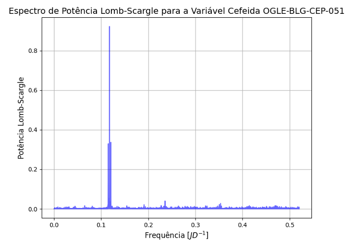
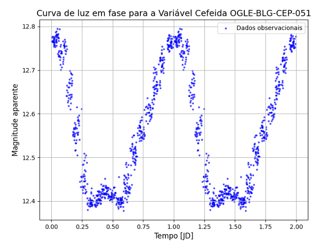
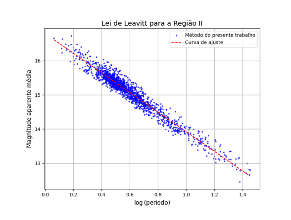
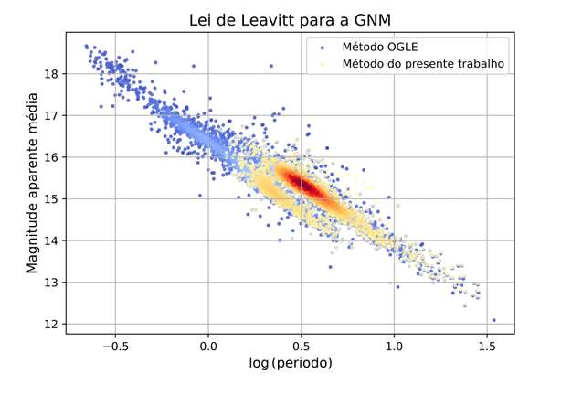
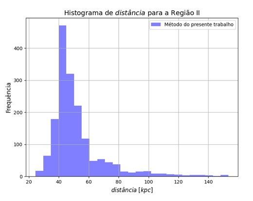

# Time Series Distance Estimation  
**Irregular time series, feature engineering and regression pipeline (NASA ADS / arXiv:2311.04470)**

This repository contains the paper PDF and analysis notebooks for a project published on **NASA ADS (arXiv:2311.04470)** that implements a complete **time series and statistical modeling pipeline** using real observational data.

The paper is written in **Portuguese**, but the methods, algorithms and results follow standard practices in **data science, time series analytics and regression modeling**.

---

## 🚀 Project Overview

The goal of this project is to build an end-to-end **time series and regression pipeline** that estimates physical distances from **large-scale, irregular observational data** by combining:

- **Irregular time series processing**
- **Period detection** using **Lomb–Scargle periodograms (Astropy)**
- **Phase-folding and feature extraction**
- **Supervised regression modeling** (period–luminosity relationship)
- **Quality filtering and outlier handling**
- **Validation against reference datasets (OGLE-IV)**

The dataset contains **4,700+ real samples** from the **OGLE-IV** catalog.

Although the application is astrophysical, the workflow directly maps to real-world problems such as **financial time series, sensor data, monitoring systems and forecasting pipelines**.

---

## 🧠 Methods and Tools

- **Time Series Analysis (irregular sampling)**
- **Lomb–Scargle Periodogram**
- **Feature engineering from periodic signals**
- **ETL and data preprocessing**
- **Statistical regression** (SciPy `curve_fit`)
- **Model validation and benchmarking**
- **Kernel Density Estimation**
- **Python** (NumPy, Pandas, SciPy, Astropy)

---

## 📂 Repository Contents

- **`docs/paper.pdf`**  
  Full scientific paper published on **NASA ADS (arXiv:2311.04470)** *(Portuguese)*

- **`notebooks/time_series_distance_pipeline.ipynb`**  
  Core notebook implementing the full pipeline: data loading, Lomb–Scargle period detection, phase-folding, regression and distance estimation.

- **`notebooks/equation_43_derivation.ipynb`**  
  Supporting notebook with mathematical and statistical derivations used in the distance estimation model.

---

## 📊 Visual Results

Selected figures from the paper and notebooks showing the data pipeline and model behavior.

### Time Series → Frequency Transformation  
*(Lomb–Scargle applied to irregular time series)*  

### Feature Engineering from Periodic Data  
*(Phase-folded time series)*  

### Regression Model on Real Data  
*(Period–luminosity relationship learned from 4,700+ samples)*  

### Model Validation vs Reference Dataset  
*(Comparison with OGLE-IV benchmark)*  

### Probability Distributions  
*(Kernel density estimation of real measurements)*  

### Model Response Curve  
*(How engineered features map to predicted target values in a regression model)*  

---

## 🔗 Publication

NASA ADS / arXiv:2311.04470  
https://ui.adsabs.harvard.edu/abs/arXiv:2311.04470

> Note: the original publication links to an older GitHub account.  
> This repository is hosted on my current GitHub profile and contains the paper PDF and the associated notebooks.

---

## 🎯 Why this project is relevant for Data & Machine Learning roles

This project demonstrates hands-on experience with:

- **Large, noisy real-world datasets**
- **Irregular time series processing**
- **Feature engineering**
- **Supervised regression models**
- **Data quality filtering**
- **Benchmarking against external datasets**
- **Reproducible Python pipelines**
- **Production-style analytical workflow with real-world data**

---

## 👤 Author

**Kevin Mota da Costa**  
Time Series • Statistical Modeling • Data Pipelines • Python
