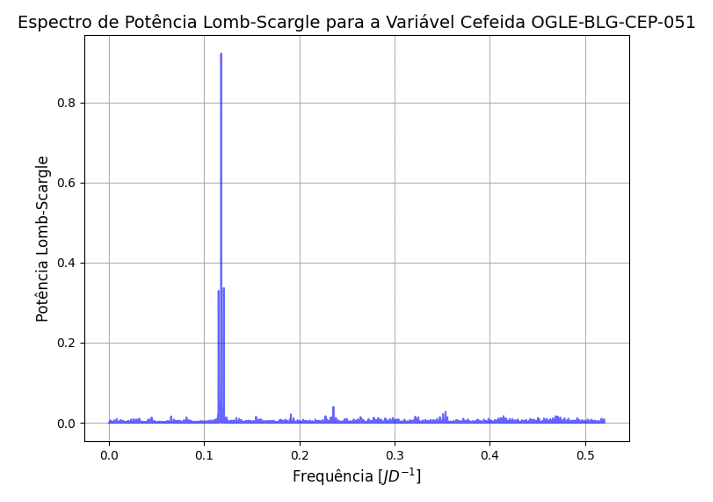
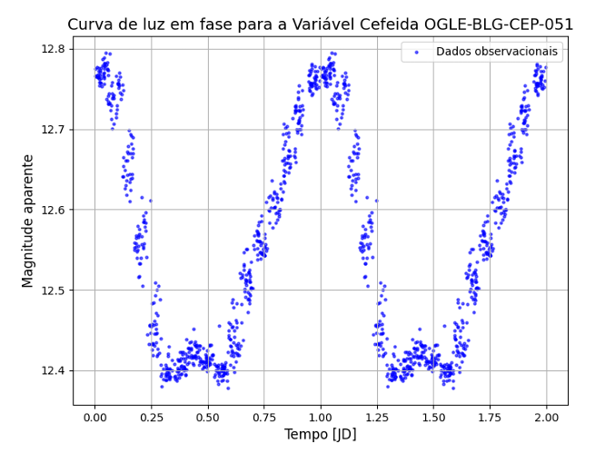
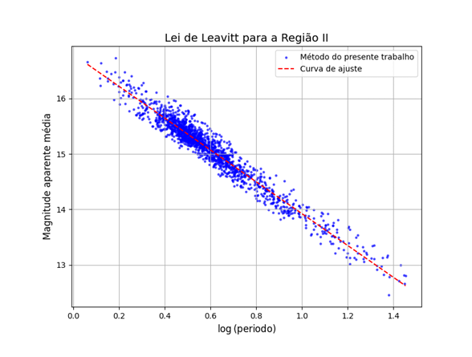
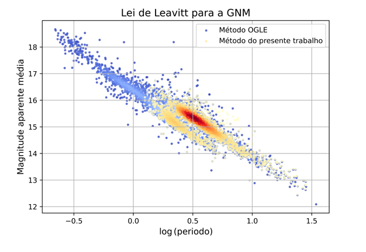
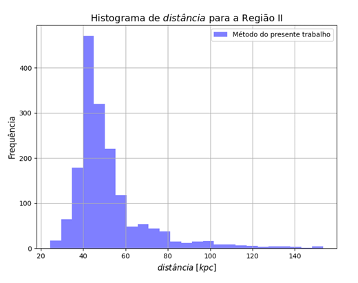
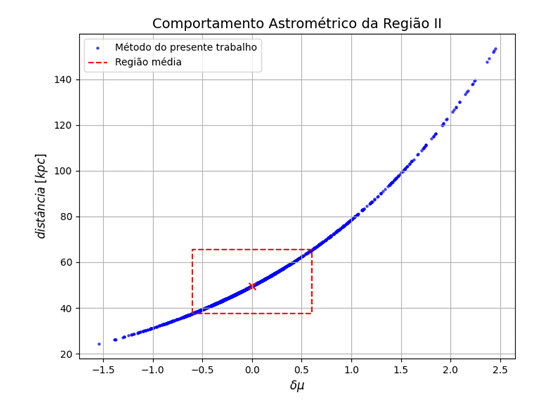

# 🚀 Time Series Distance Estimation

**Irregular Time Series Processing and Regression Pipeline (NASA ADS / arXiv:2311.04470)**

This repository contains the published paper and implementation notebooks for a large-scale time series modeling project available on NASA ADS (arXiv:2311.04470).

The project implements a complete end-to-end analytical pipeline for extracting structured features from irregular observational time series and estimating physical distances using regression modeling.

**Author:** Kevin Mota da Costa
**Portfolio:** [https://costakevinn.github.io](https://costakevinn.github.io)
**LinkedIn:** [https://linkedin.com/in/SEUUSER](https://linkedin.com/in/SEUUSER)

---

## 🎯 Project Purpose

The objective of this project was to design a robust time series and regression workflow capable of extracting meaningful patterns from large, noisy, irregularly sampled datasets.

The pipeline integrates:

* Irregular time series processing
* Period detection using Lomb–Scargle (Astropy)
* Phase-folding and feature engineering
* Supervised regression modeling
* Quality filtering and outlier handling
* Validation against external reference datasets (OGLE-IV)

Although the application is astrophysical, the workflow directly translates to financial time series, sensor monitoring, industrial analytics, and forecasting systems.

---

## 🧠 System Architecture

The analytical workflow follows a structured lifecycle:

Raw irregular time series
→ Period detection (Lomb–Scargle)
→ Frequency transformation
→ Phase-folding
→ Feature extraction
→ Regression modeling
→ Distance estimation
→ Benchmark validation

This structure mirrors production-grade time series engineering pipelines.

---

## 📊 Dataset

* 4,700+ real observational samples
* OGLE-IV reference catalog
* Irregular sampling
* Heteroscedastic measurement noise

The project includes statistical validation against benchmark datasets to ensure predictive reliability.

---

## 🔬 Methods & Techniques

* Irregular time series analysis
* Lomb–Scargle periodogram (Astropy)
* Phase-folding of periodic signals
* Feature engineering from temporal structure
* Statistical regression (SciPy `curve_fit`)
* Kernel Density Estimation
* Outlier filtering and quality control
* Benchmark validation

---

## 📈 Visual Results

### Time Series → Frequency Transformation

*(Lomb–Scargle applied to irregular data)*

---

### Feature Engineering from Periodic Data

*(Phase-folded time series)*

---

### Regression Model on 4,700+ Samples

*(Period–luminosity relationship)*

---

### Model Validation vs Reference Dataset

*(Comparison with OGLE-IV benchmark)*

---

### Probability Density Estimation

---

### Feature-to-Target Mapping

---

## 📂 Repository Contents

* `docs/paper.pdf`
  Published scientific paper (Portuguese)

* `notebooks/time_series_distance_pipeline.ipynb`
  Complete pipeline: loading, period detection, feature engineering, regression, validation

* `notebooks/equation_43_derivation.ipynb`
  Supporting statistical derivations and modeling details

---

## 🔗 Publication

NASA ADS / arXiv:2311.04470
[https://ui.adsabs.harvard.edu/abs/arXiv:2311.04470](https://ui.adsabs.harvard.edu/abs/arXiv:2311.04470)

Note: The original publication links to an older GitHub account.
This repository hosts the updated implementation and paper under my current profile.

---

## 🛠 Tech Stack

### Programming

Python

### Data & Scientific Computing

* NumPy
* Pandas
* SciPy
* Astropy

### Time Series & Statistics

* Lomb–Scargle periodogram
* Kernel Density Estimation
* Statistical regression
* Outlier filtering

### Visualization

* Matplotlib

---

## 🔬 Capabilities Demonstrated

* Large-scale irregular time series processing
* Feature engineering from periodic signals
* Regression modeling on noisy data
* Data validation against benchmark datasets
* Analytical reproducibility
* Structured ML-style pipeline design

---

## 🌐 Portfolio

This project is part of my Machine Learning portfolio:
👉 [https://costakevinn.github.io](https://costakevinn.github.io)

---

## License

MIT License — see `LICENSE` for details.
